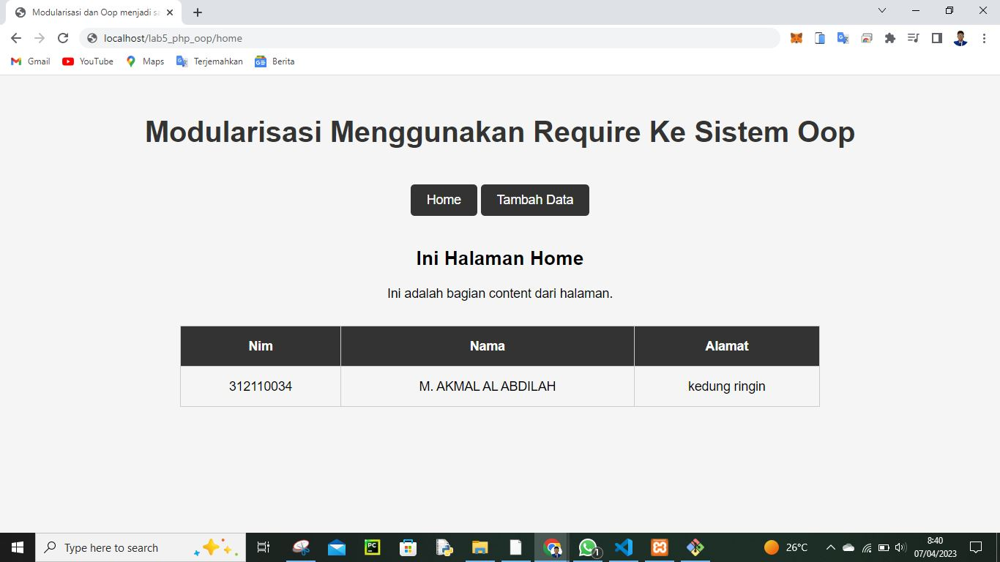
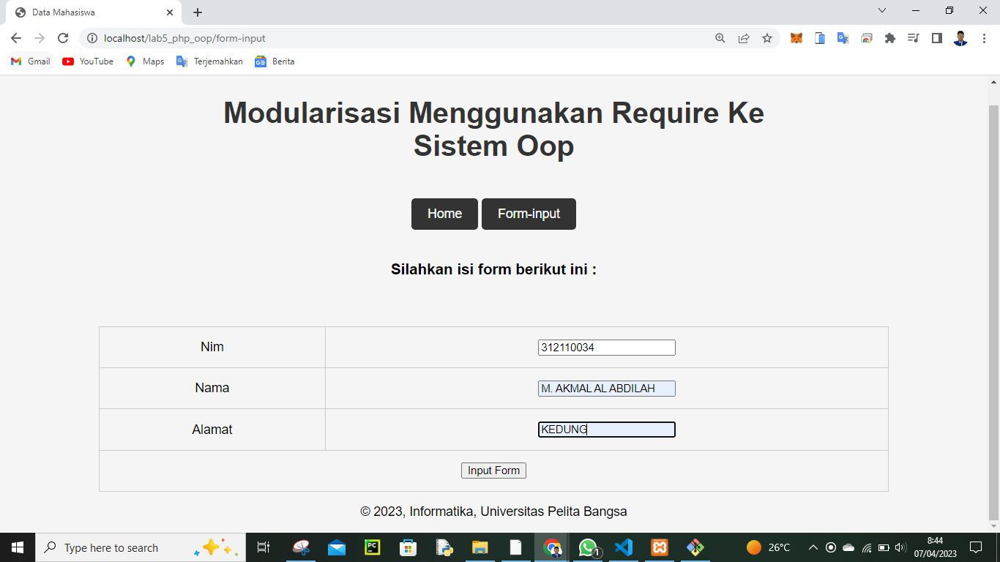
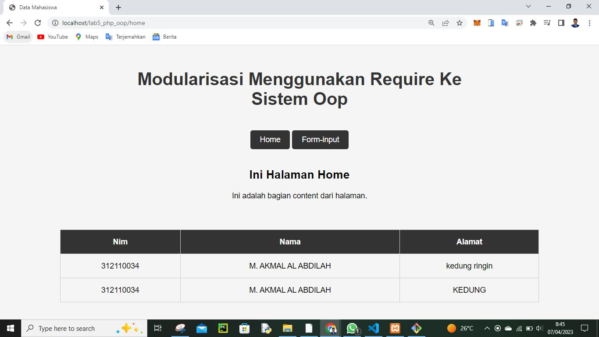

#Lab5Web

## Profil
| #               | Biodata                      |
| --------------- | ---------------------------- |
| **Nama**        | M. AKMAL AL ABDILAH          |
| **NIM**         | 312110034                    |
| **Kelas**       | TI.21.A.1                    |
| **Mata Kuliah** | Pemrograman Web 2            |

<p>
Assalam'mulaikum Kembalilagi dengan saya di tugas peratikum kali ini saya akan menjelaskan proram sederhana mengenai Implementasikan konsep modularisasi menggunakan class library dan sistem oop, baiklah dibawah ini ada gambar hasil run dari berbagai mancam kode yang terpisah dan di jadikan satu.
</p>
       








<p>
Jika kalian penasaran kalian bisa mendownload file rarnya di atas di bagian folder coding dan jika kalian mau mempelajarinya satu satu isi, file yang ada di folder coding saya sudah menjelaskan satuper satu filenya dan kalian bisa membacanya di bawah selamat membaca.
</p>


1. index.php<p>

<p>index.php adalah file utama yang menampilkan halaman web. Dalam file ini terdapat struktur HTML dasar, termasuk beberapa elemen PHP yang digunakan untuk menentukan tampilan halaman. Switch case digunakan untuk menampilkan halaman yang berbeda tergantung pada permintaan pengguna. Berikut dibawah ini merupakan, contoh codingnya.
</p>

```php
<!DOCTYPE html>
<html lang="en">

<head>
    <meta charset="UTF-8">
    <link href="style.css" rel="stylesheet" type="text/css" />
    <title>Data Mahasiswa</title>
</head>

<body>
    <div class="container">
        <div class="main">
            <table>

                <?php
                $mod = $_REQUEST['mod'];
                switch ($mod) {
                    case "home":
                        require("home.php");
                        break;
                    case "form-input":
                        require("form-input.php");
                        break;
                    case "mobil":
                        require("mobil.php");
                        break;
                    default:
                        require("home.php");
                }
                ?>
            </table>
        </div>
    </div>
</body>

</html>

```

2.config.php<p>

<p>config.php berisi konfigurasi untuk koneksi ke database. Dalam file ini, host, username, password, dan nama database disimpan dalam bentuk array asosiatif yang nantinya dapat digunakan pada kelas database.</p>

```php
<?php
return array(
    'host' => 'localhost',
    'username' => 'root',
    'password' => '',
    'db_name' => 'latihan1'
);
return $config;
?>

```

3. database.php<p>

<P>
database.php adalah file yang berisi kelas Database. Kelas ini digunakan untuk melakukan koneksi ke database, mengeksekusi query, dan mengambil hasil query. Kelas ini menggunakan konfigurasi yang ada di config.php
</p>
```php
<?php
class Database {
    protected $host;
    protected $user;
    protected $password;
    protected $db_name;
    protected $conn;
    
    public function __construct() {
        $this->getConfig();
        $this->conn = new mysqli($this->host, $this->user, $this->password, $this->db_name);
        if ($this->conn->connect_error) {
            die("Connection failed: " . $this->conn->connect_error);
        }
    }
    
    private function getConfig() {
        $config = include("config.php");
        $this->host = $config['host'];
        $this->user = $config['username'];
        $this->password = $config['password'];
        $this->db_name = $config['db_name'];
    }
    
    public function query($sql) {
        return $this->conn->query($sql);
    }
    
    public function get($table, $where=null) {
        if ($where) {
            $where = " WHERE ".$where;
        }
        $sql = "SELECT * FROM ".$table.$where;
        $sql = $this->conn->query($sql);
        $sql = $sql->fetch_assoc();
        return $sql;
    }
    
    public function insert($table, $data) {
        $columns = array();
        $values = array();
        if (is_array($data) && count($data) > 0) {
            foreach($data as $key => $val) {
                $columns[] = $key;
                $values[] = "'".$this->conn->real_escape_string($val)."'";
            }
            $columns = implode(",", $columns);
            $values = implode(",", $values);
            $sql = "INSERT INTO ".$table." (".$columns.") VALUES (".$values.")";
            $result = $this->conn->query($sql);
            if ($result === false) {
                die("Error: ".$this->conn->error);
            } else {
                return $result;
            }
        } else {
            return false;
        }
    }
    
    
    public function update($table, $data, $where) {
        $update_value = array(); // Ubah dari string kosong menjadi array kosong
        if (is_array($data)) {
            foreach($data as $key => $val) {
                $update_value[] = "$key='{$val}'";
            }
            $update_value = implode(",", $update_value);
        }
        $sql = "UPDATE ".$table." SET ".$update_value." WHERE ".$where;
        $sql = $this->conn->query($sql);
        if ($sql == true) {
            return true;
        } else {
            return false;
        }
    }
    
    
    public function delete($table, $filter) {
        $sql = "DELETE FROM ".$table." ".$filter;
        $sql = $this->conn->query($sql);
        if ($sql == true) {
            return true;
        } else {
            return false;
        }
    }
}
?>


```

4. footer.php<p>
<p>
footer.php adalah file yang berisi bagian akhir dari halaman web. File ini sering digunakan untuk menampilkan tautan ke halaman lain, hak cipta, atau informasi kontak.
</p>

```php
<head><link href="style.css" rel="stylesheet" type="text/css"></head>
<footer>
    <center><p>&copy; 2023, Informatika, Universitas Pelita Bangsa</p></center>
</footer>
</div>
</body>

</html>
```

5. form-input.php<p>

<P>
form-input.php adalah file yang berisi form untuk menginput data. File ini dapat digunakan untuk menambahkan data ke database.
</p>
```php
<?php require('header.php'); ?>

<?php
/**
* Program memanfaatkan Program 10.2 untuk membuat form inputan sederhana.
**/
include "form.php";
include "database.php";
echo "<html><head><title>Mahasiswa</title></head><body>";
$form = new Form("","Input Form");
$form->addField("txtnim", "Nim");
$form->addField("txtnama", "Nama");
$form->addField("txtalamat", "Alamat");
echo "<h3>Silahkan isi form berikut ini :</h3>";
$form->displayForm();

// Menyimpan data ke database
if ($_SERVER['REQUEST_METHOD'] == 'POST') {
    $nim = $_POST['txtnim'];
    $nama = $_POST['txtnama'];
    $alamat = $_POST['txtalamat'];
    $db = new Database();
    $data = array(
        "nim" => $nim,
        "nama" => $nama,
        "alamat" => $alamat
    );
    $result = $db->insert("akmal", $data);
    if ($result === false) {
        echo "Error: Gagal menyimpan data";
    } else {
        echo "Data berhasil disimpan";
    }
}

echo "</body></html>";

?>


<?php require('footer.php'); ?>
```

6. .htaccess<p>
<p>
.htaccess adalah file konfigurasi untuk server web Apache. File ini digunakan untuk mengatur beberapa pengaturan dasar, seperti menentukan halaman utama dan menyembunyikan ekstensi file.

</p>
```php
<IfModule mod_rewrite.c>
 RewriteEngine On
 RewriteBase /lab5_php_oop/
 RewriteCond %{REQUEST_FILENAME} !-f
 RewriteCond %{REQUEST_FILENAME} !-d
 RewriteRule ^(.*)$ index.php?mod=$1 [L]
</IfModule>
```

7. form.php<p>
<p>
form.php adalah file yang berisi kelas Form. Kelas ini digunakan untuk membuat form HTML dan memproses data yang diinputkan oleh pengguna.
</p>
```php
<?php
/**
* Nama Class: Form
* Deskripsi: CLass untuk membuat form inputan text sederhan
**/
class Form
{
private $fields = array();
private $action;
private $submit = "Submit Form";
private $jumField = 0;
public function __construct($action, $submit)
{
$this->action = $action;
$this->submit = $submit;
}
public function displayForm()
{
echo "<form action='".$this->action."' method='POST'>";
echo '<table width="100%" border="0">';
for ($j=0; $j<count($this->fields); $j++) {
echo "<tr><td 
align='right'>".$this->fields[$j]['label']."</td>";
echo "<td><input type='text' 
name='".$this->fields[$j]['name']."'></td></tr>";
}
echo "<tr><td colspan='2'>";
echo "<input type='submit' value='".$this->submit."'></td></tr>";
echo "</table>";
}
public function addField($name, $label)
{
$this->fields [$this->jumField]['name'] = $name;
$this->fields [$this->jumField]['label'] = $label;
$this->jumField ++;
}
}
?>


```

8. header.php<p>
<p>
header.php adalah file yang berisi bagian awal dari halaman web. File ini sering digunakan untuk menampilkan judul, menu navigasi, dan logo.
</p>
```php
<!DOCTYPE html>
<html lang="en">

<head>
    <meta charset="UTF-8">
    <title> Modularisasi dan Oop menjadi satu</title>
    <link href="style.css" rel="stylesheet" type="text/stylesheet" media="screen" />
</head>

<body>
    <div class="container">
        <header>
            <h1>Modularisasi Menggunakan Require Ke Sistem Oop</h1>
        </header>
        <nav>
            <a href="home.php">Home</a>
            <a href="form-input.php">Form-input</a>
        </nav>
```

9. home.php<p>
<p>
home.php adalah file yang menampilkan halaman utama aplikasi. File ini dapat berisi informasi umum, tautan ke halaman lain, atau data penting yang diambil dari database
</p>
```php
<?php require('header.php'); ?>
<div class="content">
    <h2>Ini Halaman Home</h2>
    <p>Ini adalah bagian content dari halaman.</p>
</div>

<html lang="en">

<head>
    <meta charset="UTF-8">
    <link href="style.css" rel="stylesheet" type="text/css" />
    <title>Data Mahasiswa</title>
</head>

<body>
    <div class="container">
        <div class="main">
            <table>
                <tr>
                    <th>Nim</th>
                    <th>Nama</th>
                    <th>Alamat</th>
                </tr>
                <?php
                // membuat koneksi ke database
                $conn = mysqli_connect("localhost", "root", "", "latihan1");

                // memeriksa koneksi ke database
                if (!$conn) {
                    die("Koneksi gagal: " . mysqli_connect_error());
                }

                // menjalankan query untuk menampilkan data dari database
                $sql = "SELECT * FROM akmal";
                $result = mysqli_query($conn, $sql);

                // menampilkan data
                if (mysqli_num_rows($result) > 0) {
                    while ($row = mysqli_fetch_assoc($result)) {
                        echo "<tr>";
                        echo "<td>" . $row['nim'] . "</td>";
                        echo "<td>" . $row['nama'] . "</td>";
                        echo "<td>" . $row['alamat'] . "</td>";
                        echo "</tr>";
                    }
                } else {
                    echo "<tr>";
                    echo "<td colspan='4'>Belum ada data</td>";
                    echo "</tr>";
                }

                // menutup koneksi ke database
                mysqli_close($conn);
                ?>

            </table>
        </div>
    </div>
</body>

</html>
```

10. mobile.php<p>

<p>
mobile.php adalah file yang menampilkan data mobil dari database. File ini dapat digunakan untuk menambahkan, mengedit, atau menghapus data mobil.
</p>
```php

<?php
/**

Program sederhana pendefinisian class dan pemanggilan class.
**/
class Mobil
{
private $warna;
private $merk;
private $harga;

public function __construct($warna, $merk, $harga)
{
$this->warna = $warna;
$this->merk = $merk;
$this->harga = $harga;
}

public function getWarna()
{
return $this->warna;
}

public function setWarna($warna)
{
$this->warna = $warna;
}

public function getMerk()
{
return $this->merk;
}

public function setMerk($merk)
{
$this->merk = $merk;
}

public function getHarga()
{
return $this->harga;
}

public function setHarga($harga)
{
$this->harga = $harga;
}

public function tampilWarna()
{
echo "Warna mobilnya: " . $this->warna;
}
}

// membuat objek mobil
$a = new Mobil("Biru", "BMW", 10000000);
$b = new Mobil("Merah", "Toyota", 5000000);

// memanggil objek
echo "Mobil a: warna " . $a->getWarna() . ", merk " . $a->getMerk() . ", harga " . $a->getHarga() . "<br>";
echo "Mobil b: warna " . $b->getWarna() . ", merk " . $b->getMerk() . ", harga " . $b->getHarga() . "<br>";

// mengubah warna mobil a
$a->setWarna("Hitam");

// memanggil objek setelah diubah warna nya
echo "Mobil a: warna " . $a->getWarna() . ", merk " . $a->getMerk() . ", harga " . $a->getHarga() . "<br>";
?>


```

11. style.css<p>
<p>
style.css adalah file yang berisi stylesheet untuk mengatur tampilan halaman web. File ini berisi aturan CSS yang digunakan untuk mengubah warna, tata letak, dan tampilan elemen HTML.
</p>
```php
/* Styling untuk body */
body {
    margin: 0;
    padding: 0;
    font-family: Arial, sans-serif;
    background-color: #f5f5f5;
  }
  
  /* Styling untuk container */
  .container {
      width: 80%;
      margin: 0 auto;
      text-align: center;
  }
  
  /* Styling untuk judul */
  h1 {
    margin-top: 50px;
    font-size: 36px;
    font-weight: bold;
    color: #333;
  }
  
  /* Styling untuk tabel */
  table {
    width: 100%;
    border-collapse: collapse;
    margin-top: 30px;
  }
  
  table th, table td {
    padding: 15px;
    text-align: center;
    border: 1px solid #ccc;
  }
  
  table th {
    background-color: #333;
    color: #fff;
  }
  
  /* Styling untuk link tambah data */
  a {
    display: inline-block;
    padding: 10px 20px;
    background-color: #333;
    color: #fff;
    text-decoration: none;
    margin-top: 20px;
    margin-bottom: 20px;
    border-radius: 5px;
  }
  
  a:hover {
    background-color: #555;
  }
  
  /* Styling untuk form input */
  .input {
    margin-bottom: 20px;
    text-align: left;
  }
  
  .input label {
    display: block;
    margin-bottom: 5px;
    font-weight: bold;
  }
  
  .input input, .input select {
    width: 100%;
    padding: 10px;
    border: 1px solid #ccc;
    border-radius: 5px;
    font-size: 16px;
    margin-top: 5px;
  }
  
  .input input:focus, .input select:focus {
    outline: none;
    border: 1px solid #555;
  }
  
  /* Styling untuk tombol simpan dan reset */
  .btn {
    margin-top: 20px;
  }
  
  .btn button {
    padding: 10px 20px;
    background-color: #333;
    color: #fff;
    border: none;
    border-radius: 5px;
    cursor: pointer;
    margin-right: 10px;
  }
  
  .btn button:hover {
    background-color: #555;
  }
  
  /* Styling untuk gambar */
  img {
    max-width: 150px;
    height: auto;
    margin: 0 auto;
    display: block;
    margin-top: 10px;
    margin-bottom: 10px;
  }
  
  
```

<p>
Jadi bagaimana jika penjelasan saya masih kurang tersusun saya memohon maaf kurang lebi saya ucapkan!
</p>

